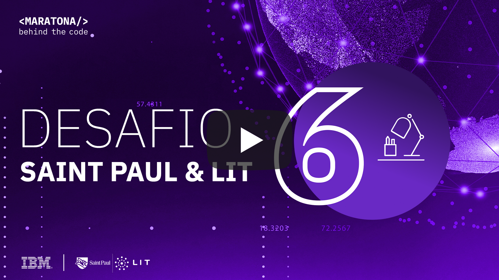

[](https://cloud.ibm.com)
<a href="https://discord.gg/2NRPpcU">
</a>

# Desafio 06 | LIT

- [1. Sobre a LIT](#1-sobre-a-lit)
- [2. Desafio de negócio](#2-desafio-de-negocio)
- [3. Objetivo](#3-objetivo)
- [4. Desenvolvendo a Solução](#4-desenvolvendo-a-solucao)
  - [4.1. Pré-requisitos](#41-pré-requisitos)
  - [4.2. Sobre a construção de modelos](#42-sobre-a-construção-de-modelos)
  - [4.3. Resumo das tarefas](#43-resumo-das-tarefas)
  - [4.4. Desenvolvimento](#43-desenvolvimento)
- [5. Submissão](#5-submissão)
- [6. Sobre a avaliação](#6-sobre-a-avaliação)

## Para te ajudar

- [Material de Apoio](#material-de-apoio)
- [Em caso de dúvidas](#em-caso-de-duvidas)
- [License](#license)

## 1. Sobre a LIT

O LIT é a plataforma digital de cursos da Saint Paul Escola de Negócios, eleita por cinco vezes uma das melhores escolas de negócios do mundo, segundo a Financial Times. 

É uma plataforma de cursos de educação executiva que conta com desde conteúdos tradicionais a  inovadores de negócios. Baseado na metodologia de aprendizagem Onlearning, em micro-momentos, micro-certificações e aprendizagem em rede, o aluno do LIT, por um valor único mensal, tem acesso ilimitado a mais de 150 cursos de diversas áreas e dificuldades.

<div align="center">
    <a href="https://www.youtube.com/watch?v=qBQt5CXsYZ8">
       
    </a>
</div>

## 2. Desafio de negócio

O LIT faz personalização do ensino com o "Paul", o primeiro tutor do mundo a utilizar a tecnologia de Inteligência Artificial IBM Watson para potencializar a aprendizagem e também a personalização, visando  ajudar o aluno a estudar da forma mais adequada para absorver o máximo de conteúdo possível sem desfocar do que ele realmente deve aprender, eliminando assim conteúdos que o aluno já sabe.
 
Nesse Desafio de Segmentação de Mercado, os participantes deverão dividir por segmentos comportamentais e por competências os alunos do LIT, para gerar uma experiência na plataforma ainda mais personalizada. 

Para tanto, neste desafio deverá ser desenvolvido uma solução tecnológica para segmentar os alunos por comportamento e competências.
 
Do ponto de vista comportamental, os alunos deverão ser divididos em 6 grupos a partir da interação do aluno ao longo de sua jornada no LIT. Cada perfil busca medir o grau de esforço do aluno dentro do progama educacional e qual a melhor jornada para o estudante.
 
Com a introdução de um novo processo de onboarding na plataforma, teemos a oportunidade de utilizar os dados preenchidos pelos alunos para fazer uma melhor recomendação de quais dos mais 150 cursos do LIT, o aluno deveria se matricular, focando em seus interesses e responsabilidades.
 
Sendo assim, esperamos poder indicar para cada aluno do LIT quais são os cursos ideais para ele, de acordo com as competências que eles precisam desenvolver para a sua carreira. Esperamos também durante a sua jornada de aprendizagem no LIT, gerar ações de engajamento de acordo com sua atividade na plataforma. 

**PREMIAÇÃO: Os 5 melhores colocados no Desafio Saint Paul | LIT ganharão bolsa de estudo MBA Blended e assinatura ao LIT.**

## 3. Objetivo

Neste desafio, você deverá utilizar um jupyter notebook para criar um modelo de aprendizado de máquina capaz, com base nas variáveis fornecidas no dataset, identificar o que define o perfil de cada aluno para poder realizar previsões sobre futuros alunos.

## 4. Desenvolvendo a solução

### 4.1. Pré-requisitos

Para realizar esse desafio você deverá cumprir os seguintes pré-requisitos:

- Registrar-se na [Maratona Behind the Code](https://ibm.biz/maratona) e confirmar seu e-mail de cadastro.
- Possuir uma conta na [IBM Cloud](https://ibm.biz/registro-maratona), podendo ser a conta FREE ou pay-as-you-go (não é necessário registrar-se no evento com o mesmo e-mail utilizado para criar sua conta na IBM Cloud).

### 4.2. Sobre a construção de modelos

Veja no vídeo abaixo uma explicação completa dos passos necessários para resolução desse desafio.

<div align="center">
    <a href="https://youtu.be/_CL7itlvezc">
       
    </a>
</div>

### 4.3. Resumo das tarefas

1. Iniciar o `notebook.ipynb` e seguir todas as instruções
2. Compactar o arquivo `results.csv` e `notebook.ipynb` em arquivo zip (pode usar qualquer nome).
3. Acessar [https://lit.maratona.dev/](https://lit.maratona.dev/) e realizar sua submissão.

### 4.4. Desenvolvimento

O objetivo principal desse desafio é criar um modelo baseado em machine learning, capaz de identificar o perfil de cada aluno, permitindo a realização de uma jornada estudantil personalizada. Esse é um típico problema de "classificação", onde dadas certas entradas o objetivo do algoritmo é descobrir a "classe" a qual cada estudante pertence.

Foram definidos seis tipo de perfis, cada um medindo o grau de esforço do aluno durante sua jornada no LIT. Sua tarefa é criar um modelo capaz de entender como os perfis se comportam para poder prever qual o perfil de futuros alunos do LIT, personalizando assim a jornada do estudante.

Para esse desafio você vai utlizar um jupyter notebook para criar o seu modelo utilizando como base o dataset `training_dataset.csv`. Fique a vontade para criar novas variáveis e novas colunas no dataset fornecido, pois, diferentemente dos desafios anteriores, neste desafio não será necessário nesse desafio fazer o deploy da solução no Watson MAchine Learning, contudo, você deverá preencher os perfis da planilha `results.csv` utilizando o seu modelo.

Com o aquivo `results.csv` devidamente preendchido voce deve compactá-lo junto com o seu notebook da seguinte forma e com os respectivos nomes:
```bash
meu_zip.zip
|-results.csv
|-notebook.ipynb
```

## 5. Submissão

Para realizar a submissão, primeiramente você deverá acessar a seguinte aplicação: https://lit.maratona.dev/ e preencher o formulário com o arquivo zip contendo o arquivo `results.csv` que você deve preencher com seu modelo, bem como o jupyter notebook que contendo todos os passos que você tomou na construção do modelo.

Após realizar o upload do arquivo, insira seu email para realizar sua submissão.

## 6. Sobre a avaliação

O sistema testará se o seu modelo foi capaz de inferir corretamente cada linha da planilha `results.csv` de acordo com as métricas existentes de modelos de aprendizado de máquina.

## Material de apoio

- [Documentação jupyter notebook](https://jupyter.org/)
- [Documentação Pandas](https://pandas.pydata.org/)
- [Documentação Scikit-Learn](https://scikit-learn.org/stable/)

Você também pode acessar o discord oficial da Maratona 2020 para realizar perguntas e/ou interagir com outros participantes: [Discord](https://discord.gg/2NRPpcU).

## License

Copyright 2020 Maratona Behind the Code

Licensed under the Apache License, Version 2.0 (the "License");
you may not use this file except in compliance with the License.
You may obtain a copy of the License at

       http://www.apache.org/licenses/LICENSE-2.0

Unless required by applicable law or agreed to in writing, software
distributed under the License is distributed on an "AS IS" BASIS,
WITHOUT WARRANTIES OR CONDITIONS OF ANY KIND, either express or implied.
See the License for the specific language governing permissions and
limitations under the License.
